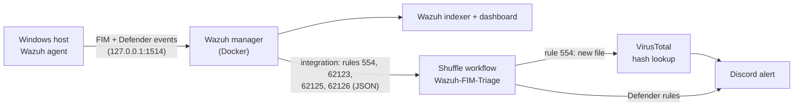
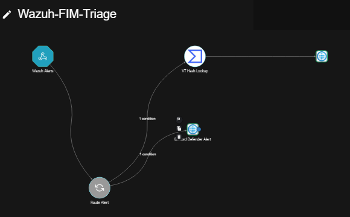
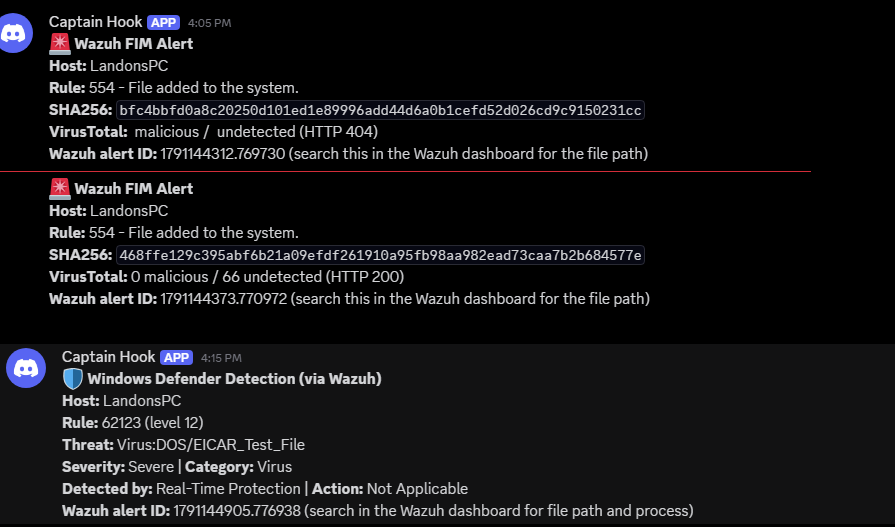
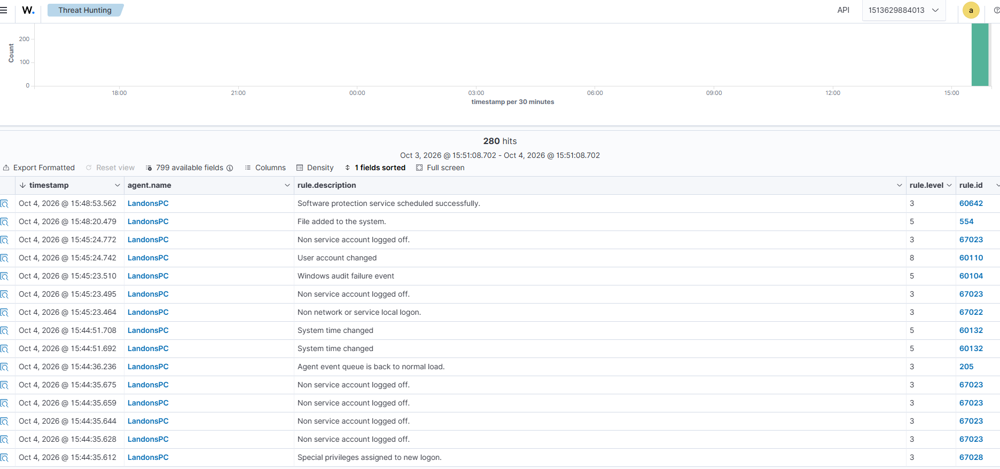

# Wazuh + Shuffle SOAR Lab

A local security-automation lab: **Wazuh SIEM** detects file and malware events on a Windows host, **Shuffle SOAR** triages them, **VirusTotal** enriches file hashes, and **Discord** gets the result in near-real time. Everything runs in Docker Desktop on one Windows PC.

> Companion to my internet-facing IDS project: [homelab-soc](https://github.com/landonfr/homelab-soc).

## Architecture



| Trigger | Wazuh rule | Shuffle route |
|---|---|---|
| New file in the monitored folder (real-time FIM) | 554 | VirusTotal hash lookup, then Discord |
| Windows Defender detected malware (event 1116) | 62123 | Discord |
| Defender failed to act (event 1118) | 62125 | Discord |
| Defender critical error (event 1119) | 62126 | Discord |

The Wazuh manager joins Shuffle's Docker network (`shuffle_shuffle`) and posts to `http://shuffle-backend:5001`, so the webhook never has to be exposed outside Docker.

## Repo layout

```
wazuh/
  docker-compose.yml                    # single-node Wazuh 4.14.8, hardened (see below)
  .env.example                          # passwords live in .env, never in the compose file
  config/wazuh_cluster/shuffle-integration.xml   # <integration> block added to wazuh_manager.conf
  config/wazuh_dashboard/wazuh.yml
  config/wazuh_indexer/internal_users.yml        # demo users removed
agent/
  agent.conf                            # pushed to the Windows agent: FIM folder + Defender log
shuffle/
  docker-compose.yml                    # Shuffle, modified to run on Docker Desktop for Windows
  workflows/                            # exported Wazuh-FIM-Triage workflow
docs/screenshots/
```

These are the files I changed. The rest comes from the official [wazuh-docker](https://github.com/wazuh/wazuh-docker) and [Shuffle](https://github.com/Shuffle/Shuffle) repos.

## Hardening

- **Every published port bound to `127.0.0.1`**: the Wazuh manager, indexer and dashboard, plus the Shuffle frontend and backend. The Wazuh API (55000) isn't published at all. Nothing in the lab can be reached from the LAN.
- **Default credentials replaced.** The stock passwords (`SecretPassword`, `MyS3cr37P450r.*-`, `kibanaserver`) were rotated and moved into a `.env` file referenced as `${VARS}`.
- **Demo users removed from the indexer** (`kibanaro`, `logstash`, `readall`, `snapshotrestore`).
- **`restart: unless-stopped`** instead of `always`, so a stopped lab stays stopped.
- **Secrets stay out of git.** `.env`, TLS keys and Shuffle runtime data are git-ignored, and the webhook ID and password hashes in this repo are placeholders.

## Troubleshooting notes

Problems I hit getting both stacks running on Docker Desktop for Windows:

| Problem | Cause | Fix |
|---|---|---|
| Shuffle workflows never ran | `SHUFFLE_SWARM_CONFIG=run` needs a Docker Swarm manager, which Docker Desktop isn't, so workers never started | Disabled swarm mode so Orborus runs workers as plain containers |
| Port 9200 conflict | Both Wazuh's indexer and Shuffle's OpenSearch wanted host port 9200 | Removed Shuffle's host mapping; its backend reaches OpenSearch over the internal network |
| Shuffle database volume failed to mount | Bind-mount `driver_opts` don't work on Docker Desktop for Windows | Switched to a named Docker volume |
| Worker containers piling up | `CLEANUP=false` keeps every run's container | Set `CLEANUP=true` |
| Memory pressure | Shuffle's OpenSearch defaulted to a 3 GB heap next to Wazuh's indexer | Lowered the heap to 1.5 GB |
| Wazuh couldn't reach the Shuffle webhook | The two stacks were on separate Docker networks | Added the external `shuffle_shuffle` network to the Wazuh manager |
| Live alerts reached Discord with blank fields, and file alerts took the Defender branch | Wazuh's `shuffle` integration wraps each alert as `{rule_id, title, ..., all_fields: <alert>}`, so `$exec.rule.id` didn't exist. `Route_Alert` raised `shuffle_variable_error`, the empty rule ID matched "does not equal 554", and everything went to the Defender node | Changed every variable to `$exec.all_fields.*` (for example `$exec.all_fields.rule.id`) |
| Defender detected EICAR (event 1116) but no alert reached Wazuh | After the manager had been unreachable, the agent stopped forwarding the `Windows Defender/Operational` channel even though it showed Active. Wazuh had received no Defender events that day | Restarted the agent (`Restart-Service WazuhSvc`, as admin); the next EICAR test produced rule 62123 alerts that ran through Shuffle with no errors |
| Agent suddenly "Disconnected" after a reboot; the manager had no host ports open | Windows reserved TCP 54970–55069 (`netsh int ipv4 show excludedportrange protocol=tcp`), which includes the Wazuh API port 55000, so Docker Desktop published none of the manager's ports | Stopped publishing 55000 to the host, since the dashboard reaches the API over the Docker network; the agent reconnected |

## Setup

1. **Shuffle (start it first, because Wazuh joins its network)**
   ```bash
   git clone https://github.com/Shuffle/Shuffle shuffle && cd shuffle
   cp ../wazuh-soar-lab/shuffle/docker-compose.yml .
   docker compose up -d
   ```
   Open Shuffle at `http://127.0.0.1:3001`, import the workflow from `shuffle/workflows/`, add your VirusTotal API key and Discord webhook in the workflow, and copy the webhook trigger's URL.

2. **Wazuh**
   ```bash
   git clone https://github.com/wazuh/wazuh-docker -b v4.14.8 && cd wazuh-docker/single-node
   cp -r ../../wazuh-soar-lab/wazuh/* . && cp ../../wazuh-soar-lab/wazuh/.env.example .env   # then set real passwords
   docker compose -f generate-indexer-certs.yml run --rm generator
   ```
   Paste the contents of `config/wazuh_cluster/shuffle-integration.xml` into `config/wazuh_cluster/wazuh_manager.conf` before the first `</ossec_config>`, with your webhook ID filled in. Generate bcrypt hashes for `internal_users.yml`, then run `docker compose up -d`.

3. **Windows agent.** Install the Wazuh agent, point it at `127.0.0.1`, and put `agent/agent.conf` in the manager's `/var/ossec/etc/shared/default/agent.conf` so it's pushed to the agent.

4. **Test.** Drop a file into the monitored folder. Within seconds Wazuh fires rule 554, Shuffle looks the file hash up on VirusTotal, and the verdict appears in Discord.

## Screenshots

**Wazuh-FIM-Triage workflow in Shuffle:** the webhook trigger, `Route_Alert`, the VirusTotal lookup and the two Discord nodes.



**Discord alerts, from top to bottom:**
1. A brand-new test file. VirusTotal returns HTTP 404 because it has never seen the hash, which is expected.
2. A copy of `notepad.exe`. VirusTotal knows the hash and reports **0 malicious / 66 undetected**.
3. Windows Defender catching the EICAR test file (rule 62123, level 12).



**Wazuh Threat Hunting:** events from the Windows agent, including the rule 554 "File added to the system" alert that starts the workflow.



## Skills demonstrated

SIEM deployment and configuration · SOAR workflow automation · threat-intel enrichment · Windows file integrity monitoring and Defender log collection · Docker networking and Compose · container hardening · troubleshooting on Docker Desktop for Windows
