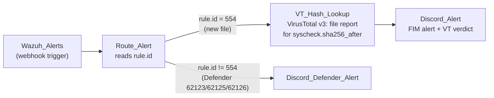

# Workflows

## Wazuh-FIM-Triage.json

| Node | App | What it does |
|---|---|---|
| `Wazuh_Alerts` | Webhook trigger | Receives JSON alerts from the Wazuh `shuffle` integration |
| `Route_Alert` | Shuffle Tools | Passes the rule ID through so branch conditions can route on it |
| `VT_Hash_Lookup` | VirusTotal v3 | Looks up the new file's SHA-256 (`$exec.syscheck.sha256_after`) |
| `Discord_Alert` | HTTP POST | Sends the host, rule, file path and VirusTotal result to Discord |
| `Discord_Defender_Alert` | HTTP POST | Sends Windows Defender detections to Discord |

### Importing

1. In Shuffle, go to **Workflows**, choose **Import**, and select this file.
2. Add your **VirusTotal API key** to `VT_Hash_Lookup` (Shuffle stores it as an app authentication).
3. Paste your **Discord webhook URL** into the `url` field of both Discord nodes.
4. Copy the webhook trigger's ID into `wazuh/config/wazuh_cluster/shuffle-integration.xml`, replacing `YOUR-SHUFFLE-WEBHOOK-ID`.

The API key and Discord URLs aren't in the export, and the webhook ID has been replaced with a placeholder.
